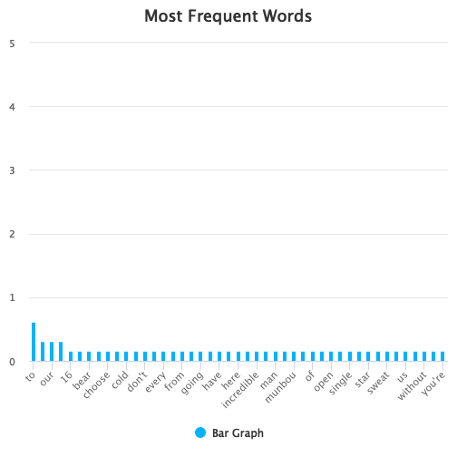

## Introduction of App

The Twitter Analytics App will read upto 5000 latest Tweets for the selected Word or User Handle and perform Analytics on it. 

The App is made using R Shiny Dashboard Paclage.

The App makes use of the library (rtweet) to extract the Tweets and other popular R packages in performing various Analytics. 

The App will work on two modes. 

> 1. Word Mode
> 2. User Mode 

Word Mode will take Word/Words/Hashtags as input and User Mode will take User Handle as input. 

User can select any number of tweets upto 5000 using the Input Slider. 

The App will run upon clicking the Submit Button. 

--- 

## Analytics performed in the App ###

The App performs the following Analytics:

> 1. Most Retweeted Tweets for the selected Word/User
> 2. Most Frequent Hashtags for the selected Word/User
> 3. Most Frequent Words for the selected Word/User 
> 4. Most Frequent Tweeter for the selected Word/User
> 5. Sentiment Analysis of the Tweets for the selcted Word/User 

--- 

### Demo of Most Frequent Words using Demo Tweets of Manchester United 

Just for a demo purpose, I have copied three Tweets by Manchester United and performed the Frequent Words Analysis in it. (Tweet data is created in R, unlike in App where it is read automatically in real time.)

---

## Further Improvements in Future 

> 1. Work on making UI more user friendly
> 2. Integration of CSS and HTML to make UI more beautiful.
> 3. Addition of Advanced Analytics like Topic Modeling
> 4. Addition of more Advanced Visuals for the Text Data 

